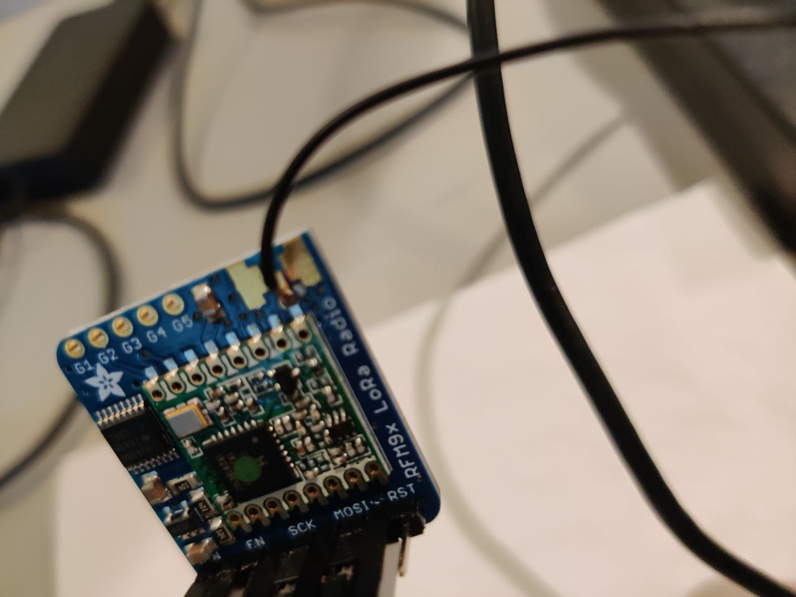
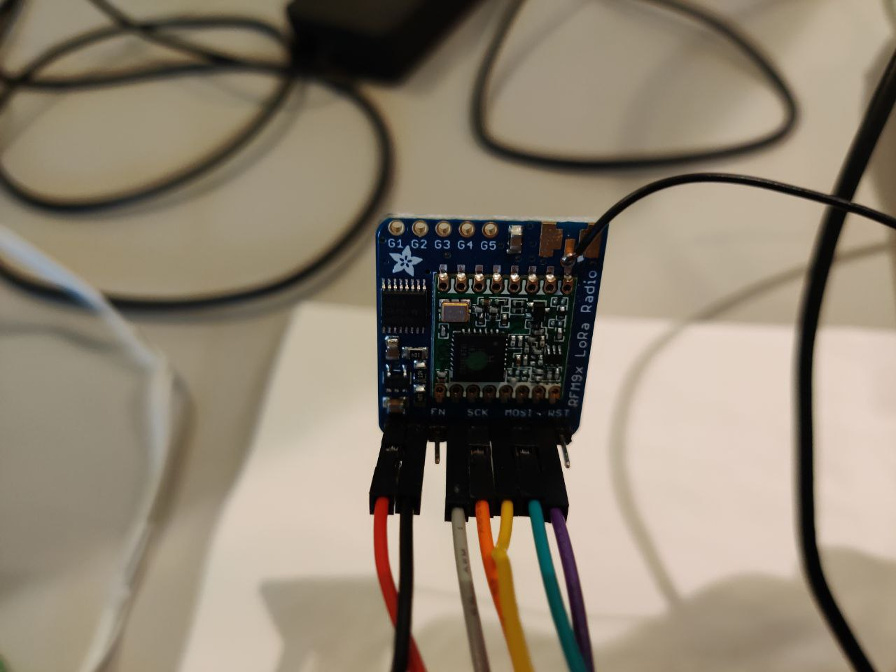
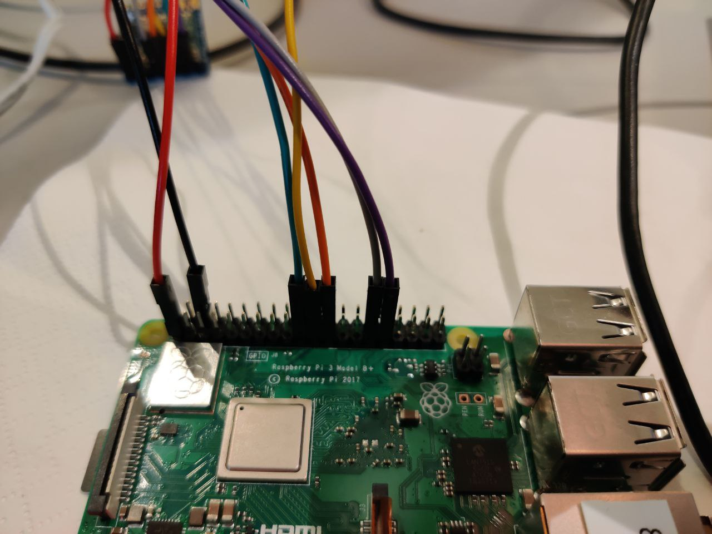
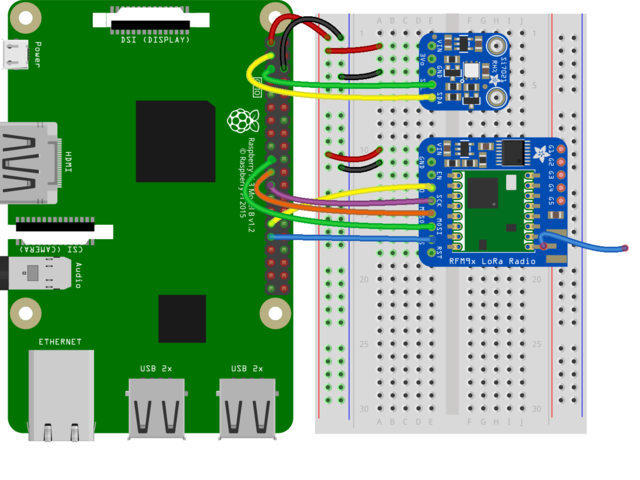

# mshack2020-hardware

https://learn.adafruit.com/using-lorawan-and-the-things-network-with-circuitpython
https://github.com/adafruit/TinyLoRa

- Pi 3V to Radio VIN 
- Pi GND to Radio GND
- Pi SCK to Radio SCK
- Pi MOSI to Radio MOSI
- Pi MISO to Radio MISO
- Board D5 to Radio G0
- Board D6 to Radio CS

